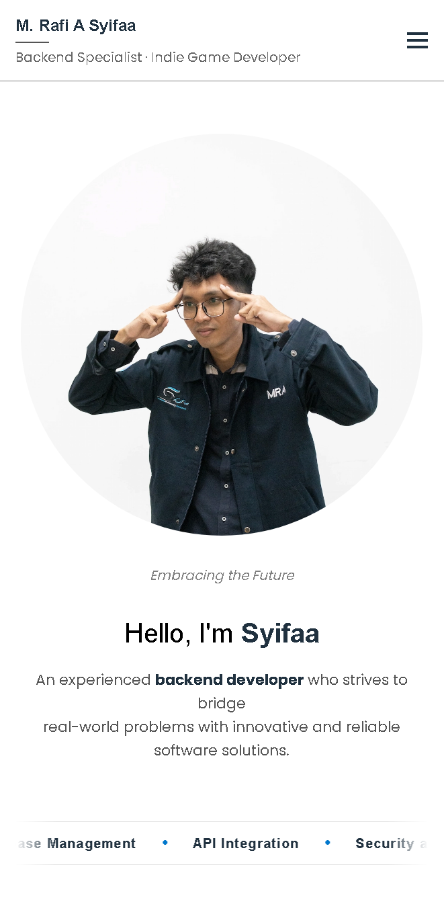

# Personal Portfolio - Muhammad Rafi A Syifaa

This repository contains the source code for my personal portfolio and digital branding website.

The purpose of this website is to serve as a digital resume, project gallery, and primary contact point for potential employers, clients, and collaborators to understand who I am and what I've worked on.

**[Visit the Live Site Here](https://revou-fsse-oct25.github.io/milestone-1-mrafiasyifaa/)**

---

---

---

## 🚀 Overview

As a developer, building a digital presence is key. This website represents my professional platform to:
* **Showcase Projects:** Document and exhibit my technical work in the Software Engineering field.
* **Share My Story:** Provide context about my background, skills, and professional interests.
* **Be a Point of Contact:** Make it easy for anyone to connect with me via the contact form or social media.

---

## ✨ Key Features & Implementation

This website has been upgraded to meet high standards of responsive design, modern aesthetics, and accessibility.

### 1. Visual Design & Animations (CSS3)
* **Modern Typography:** Integrated **Google Fonts** pairing:
    * **Space Grotesk** for Headings (Futuristic/Tech look).
    * **Poppins** for Body text (Clean & Readable).
* **Infinite Marquee Animation:** A continuously looping animation in the Hero section displaying my technical stack (Golang, Unity, Node.js, etc.).
* **Parallax Scrolling Effect:** Implemented a fixed background image in the "Quote Section" to demonstrate advanced CSS positioning (`background-attachment: fixed`).
* **Grayscale-to-Color Interaction:** Project cards appear in monochrome by default and reveal full color upon hover using CSS `filter` and `transition` properties.

### 2. Layout & Responsiveness
* **Mobile-First Friendly:** The site is optimized for various screen sizes using multiple breakpoints:
    * `max-width: 480px` for small mobile adjustments.
    * `max-width: 768px` for tablet/standard mobile layouts.
* **Advanced Grid Layouts:**
    * **Asymmetrical Grid:** Used in the **About Section** to create a dynamic "bento-style" gallery (1 large image vs 2 stacked small images).
    * **Responsive Grid:** The Project Gallery automatically adjusts columns based on screen width.
* **Fluid Images:** All images utilize `max-width`, `vw` units, and `object-fit: cover` to ensure they scale perfectly without distortion.

### 3. Functionality & Accessibility (JS & A11y)
* **Hamburger Menu:** A responsive navigation drawer for mobile devices that slides in smoothly using JavaScript class toggling.
* **Functional Contact Form:** Includes frontend validation and a JavaScript-handled submission simulation that shows a success message without reloading the page.
* **Accessibility Focused:**
    * **Semantic HTML:** Proper use of `<header>`, `<main>`, `<article>`, and `<figure>`.
    * **ARIA Labels:** Added descriptions for icon-only buttons.
    * **Screen Reader Utilities:** Implementation of a `.sr-only` class for hidden labels (e.g., Language Dropdown).

---

## 🛠️ Technology Stack

* **HTML5 (HyperText Markup Language)**
    * **Role:** Semantic structure and content organization.
    * **Key Features:** Semantic tags, Accessibility attributes (`aria-label`, `role`), and Responsive Meta tags.

* **CSS3 (Cascading Style Sheets)**
    * **Role:** Visual styling, layout, and motion.
    * **Key Features:**
        * **Flexbox & Grid:** For complex layouts.
        * **CSS Variables:** For consistent theming (`--primary-color`, `--font-heading`).
        * **Animations:** `@keyframes` for the marquee effect.
        * **Filters:** `grayscale()` for visual feedback.
        * **Media Queries:** For responsive adaptation.

* **JavaScript (Vanilla JS - ES6+)**
    * **Role:** Interactive functionality.
    * **Key Features:** DOM Manipulation (`classList.toggle`, `addEventListener`) for the navigation menu and form handling. No external frameworks used.

---

## 📁 Running The Project Locally

You can run a copy of this project on your local machine for testing or development.

1.  **Clone the Repository**
    ```bash
    git clone [https://github.com/revou-fsse-oct25/milestone-1-mrafiasyifaa.git](https://github.com/revou-fsse-oct25/milestone-1-mrafiasyifaa.git)
    ```
2.  **Navigate to the Project Folder**
    ```bash
    cd milestone-1-mrafiasyifaa
    ```
3.  **Open the `index.html` File**
    * Simply double-click the `index.html` file.
    * No server or dependencies needed.

---

## 🔮 Future Features

This website is an evolving project. Here are some features planned for future updates:

* **Language Switch Functionality:** Enable the "English/Bahasa Indonesia" dropdown button to dynamically change the text content using JSON data.
* **Dark Mode Toggle:** Add a switch to toggle between light and dark themes using CSS variables.
* **Project Detail Pages:** Create dedicated pages for each project case study.
* **Backend Integration:** Connect the contact form to a real email service (e.g., EmailJS or a Node.js backend).
* **Direct Download to my CV:** Adding download button to my portfolio and CV in ATS Format.

[](https://classroom.github.com/a/KTVBmApB)