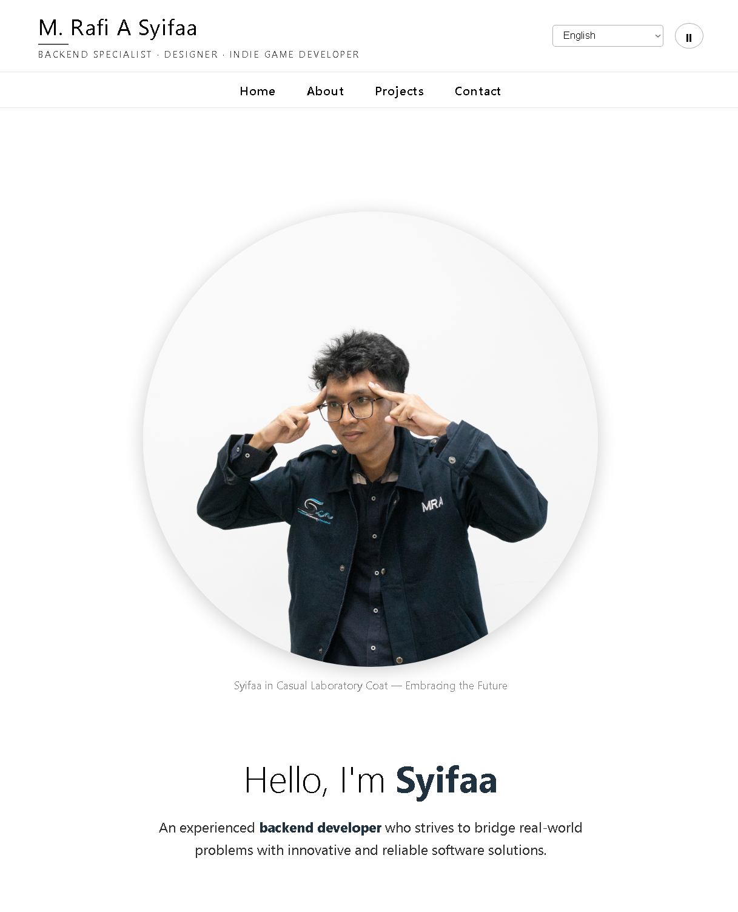

# Personal Portfolio - Muhammad Rafi A Syifaa

This repository contains the source code for my personal portfolio and digital branding website.

The purpose of this website is to serve as a digital resume, project gallery, and primary contact point for potential employers, clients, and collaborators to understand who I am and what I've worked on.

**[Visit the Live Site Here](https://revou-fsse-oct25.github.io/milestone-1-mrafiasyifaa/)**



---

## 🚀 Overview

As a developer, building a digital presence is key. This website is my first step in creating a professional platform to:
* **Showcase Projects:** Document and exhibit my technical work in the Software Engineering field.
* **Share My Story:** Provide context about my background, skills, and professional interests.
* **Be a Point of Contact:** Make it easy for anyone to connect with me via the contact form or social media.

---

## ✨ Detailed Features

This website is designed with several interactive and structural features to enhance user experience.

### 1. Interactivity & Media

* **Background Music Player:**
    * **Global Controls:** A play/pause button (`⏸`/`▶`) located in the main header, allowing users to control music from any section of the site.
    * **Collapsible Playlist:** A toggleable playlist section on the *Home* page to save space.
    * **Song Selection:** Users can select specific tracks from two categories (*Relaxing* & *Adventurous*) to play.
    * **Implementation:** Built using the HTML5 `<audio>` tag and controlled with JavaScript event listeners (`getElementById`, `addEventListener`).

### 2. Navigation & UI

* **Dual Sticky Navigation System:**
    * **Main Header:** The top container (with name and music controls) uses `position: sticky` to always stay in view.
    * **Navigation Menu:** The `<nav>` bar below it also uses `position: sticky`, ensuring links to sections (Home, About, etc.) are always accessible while scrolling.
* **Functional Contact Form (Client-Side):**
    * **HTML5 Validation:** Uses the `required` attribute on Name, Email, and Message inputs to ensure data is filled out.
    * **Submission Simulation:** Uses JavaScript (`e.preventDefault()`) to handle the submit event. This displays a "Message sent successfully!" status and automatically resets the form without a page reload.

### 3. Structure & Content

* **Flexible Project Gallery:**
    * Uses CSS Flexbox (`display: flex`, `flex-wrap: wrap`, `flex: 1 1 300px`) to create an adaptive project card layout.
    * Separates projects into "Projects Done" and "Future Projects" to manage expectations.
* **Semantic HTML Structure:**
    * Extensive use of semantic tags (`<header>`, `<nav>`, `<main>`, `<section>`, `<article>`, `<figure>`, `<footer>`) to improve SEO and screen reader accessibility.

---

## 🛠️ Technology Stack

Each technology was chosen for its specific role in building this website:

* **HTML5 (HyperText Markup Language)**
    * **Role:** The primary skeleton and structure of the site.
    * **Details:** Used to structure all content. Specific HTML5 features include *meta tags* (`description`, `keywords`) for SEO, the `<audio>` tag for the music player, and `required` attributes for form validation.
* **CSS3 (Cascading Style Sheets)**
    * **Role:** Designing and providing the visual appearance of the site.
    * **Details:** Currently, styling is implemented using **Inline CSS** (`style="..."` attributes directly in the HTML tags). This is used to manage layout (Flexbox), colors, fonts, padding, margins, and the `backdrop-filter: blur()` effect.
* **JavaScript (Vanilla JS - ES6+)**
    * **Role:** Providing interactivity and functionality (the "brain" of the site).
    * **Details:** Vanilla JavaScript (no libraries) is used to:
        * Control the `play()`, `pause()`, and `player.src` logic for the music player.
        * Handle click events on the music button and playlist.
        * Manage the submit event for the contact form.
        * Perform simple DOM manipulation (e.g., changing button `textContent` and status message `display`).

---

## 📁 Running The Project Locally

You can run a copy of this project on your local machine for testing or development.

1.  **Clone the Repository**
    ```bash
    git clone [https://github.com/revou-fsse-oct25/milestone-1-mrafiasyifaa.git](https://github.com/revou-fsse-oct25/milestone-1-mrafiasyifaa.git)
    ```
2.  **Navigate to the Project Folder**
    ```bash
    cd milestone-1-mrafiasyifaa
    ```
3.  **Open the `index.html` File**
    * Simply double-click the `index.html` file in your file explorer, or right-click and select "Open with..." your browser of choice.
    * No server or dependencies need to be installed.

---

## 🔮 Future Features

This website is an evolving project. Here are some features planned for future updates:

* **Migration to External CSS:** Move all inline CSS styles into an external `style.css` file for a cleaner, more maintainable codebase and better caching performance.
* **Responsive Design (Mobile-First):** Add CSS Media Queries to make the site look and function perfectly on mobile devices and tablets, not just desktops.
* **Language Switch Functionality:** Enable the "English/Bahasa Indonesia" dropdown button to actually change the text content on the site.
* **Project Detail Pages:** Make the "Learn more about this project →" links functional, leading to new pages dedicated to each project's case study, tech stack, and challenges.
* **Downloadable CV:** Add a button/link to allow visitors to download a PDF version of my professional resume.

[](https://classroom.github.com/a/KTVBmApB)
